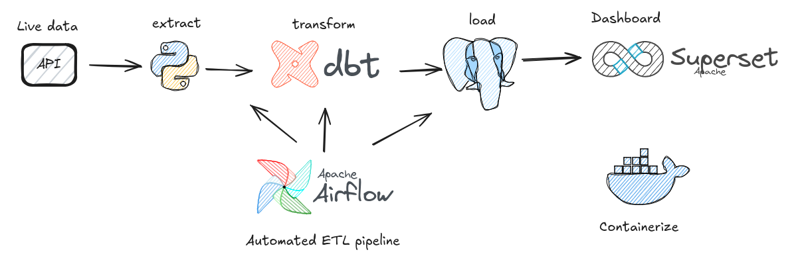
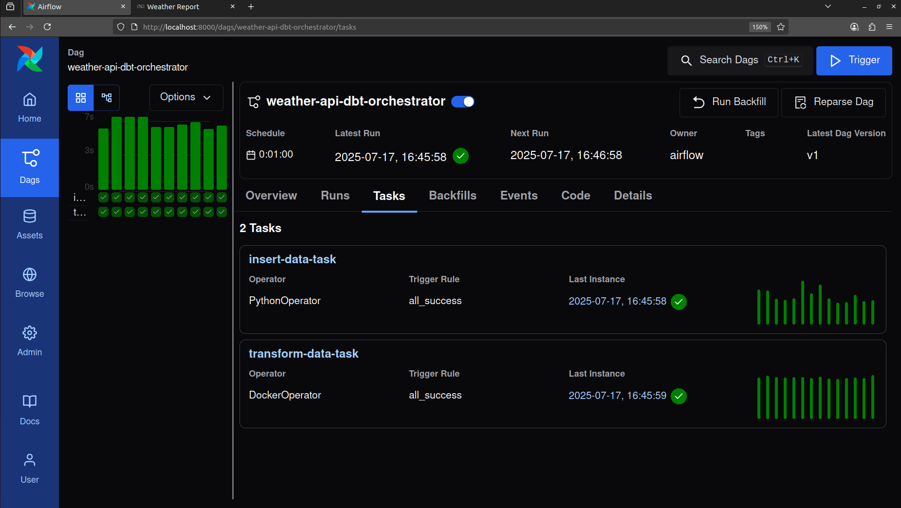
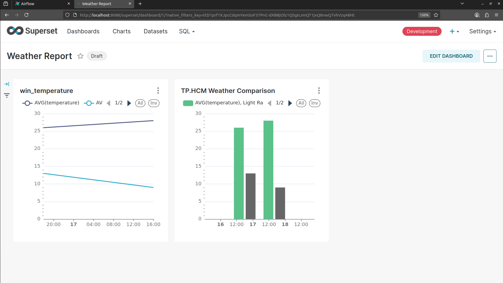

# Weather Real-Time Pipeline

[](LICENSE)
[](https://www.python.org)

A Data Engineering pipeline to collect, process, store, and visualize real-time weather data for Ho Chi Minh City (TP.HCM) using Airflow, DBT, PostgreSQL, and Superset.

## Overview
This pipeline fetches TP.HCM weather data via API, transforms it with DBT, stores it in PostgreSQL, and visualizes it in a Superset dashboard.


## Pipeline
<p align="center">
  
</p>

1. Ingestion: api-request/api_request.py fetches data; insert_records.py saves to weather_data.
2. Transformation: DBT models (stg_weather_data.sql, daily_average.sql, weather_report.sql) clean and aggregate data.
3. Storage: PostgreSQL.
4. Orchestration: Airflow (airflow/dags/orchestrator.py) schedules tasks.
<p align="center">
  
</p>

5. Visualization: Superset dashboard
 <p align="center">
  
</p>

## Setup
1. Clone repository:
   ```bash
   git clone https://github.com/<username>/<repo>.git
   cd Weather-RealTime-Pipeline
   ```
2. Start services:
   ```bash
   docker-compose up 
   ```
3. Run DBT:
   ```bash
   docker exec -it dbt_container dbt run
   ```
4. Configure Superset:
   - Access: http://localhost:8088 (default: admin/admin)
   - Add database: postgresql+psycopg2://superset:superset@db:5432/superset_db
5. Create charts:
6. Create dashboard:
   - Add charts to Weather Dashboard
   - Add Filter Box for weather_time_local & weather_descriptions

## Usage
- Access Superset: http://localhost:8088
- View Weather Dashboard and filter data
- Export charts: Charts > [Chart Name] > Download > PNG

## License
[MIT License](LICENSE)